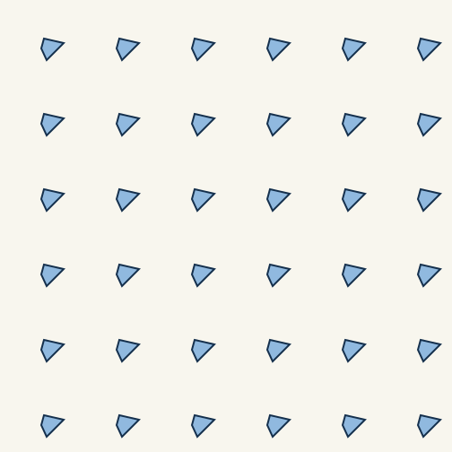
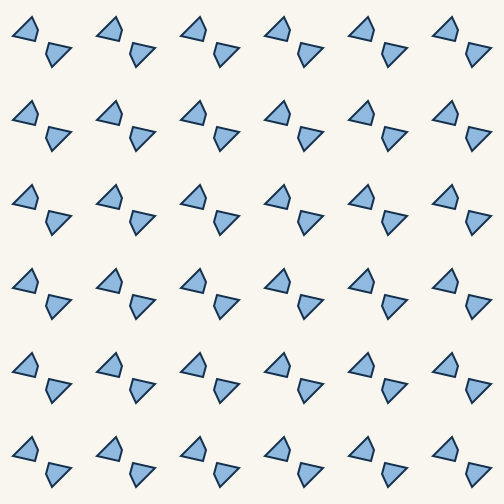
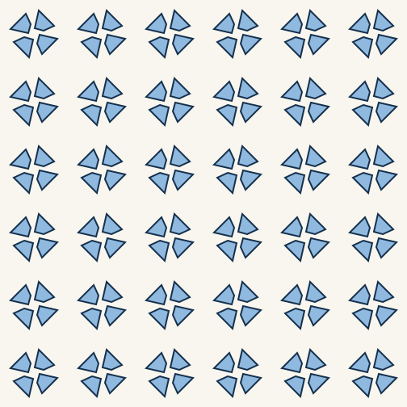
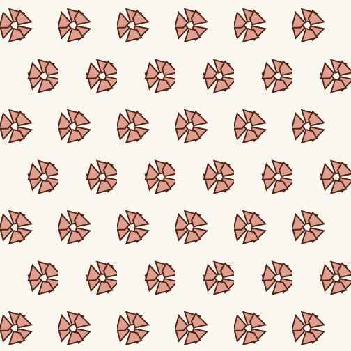
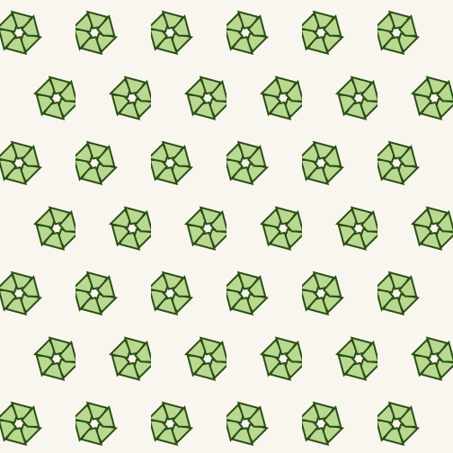
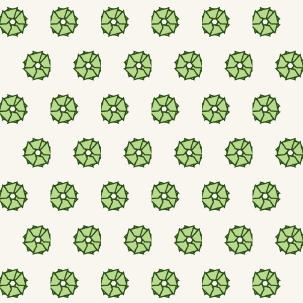

# Pattern gallery

These SVGs are compact, reproducible reconstructions of the currently supported Euclidean Conway shorthands. They use one deliberately asymmetric seed so the effect of rotations and reflections stays visible.

| Conway symbol | image |
| --- | --- |
| `o` |  |
| `2222` |  |
| `442` |  |
| `*442` |  |
| `333` |  |
| `*333` |  |
| `632` |  |
| `*632` |  |

The Calegari-inspired turtle example is rendered separately:

These gallery files are illustrations, not the compiler. The `.pattern` scripts under `examples/` are the editable language inputs.
