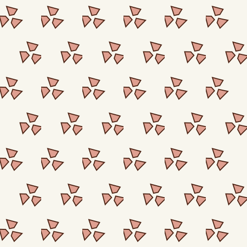
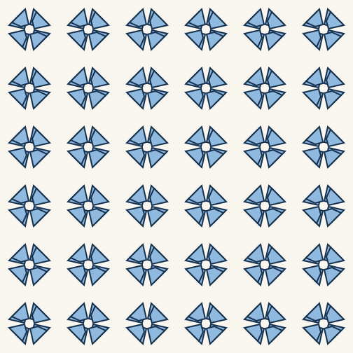
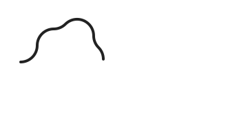

# Wallpapers

These SVGs show the currently supported Euclidean Conway shorthands. They use one deliberately asymmetric seed so rotations and reflections stay visible.

| Conway symbol | Render | Pattern source |
| --- | --- | --- |
| `o` |  | [`o.pattern`](../pattern-language/examples/orbifolds/o.pattern) |
| `2222` |  | [`2222.pattern`](../pattern-language/examples/orbifolds/2222.pattern) |
| `333` |  | [`333.pattern`](../pattern-language/examples/orbifolds/333.pattern) |
| `*333` |  | [`star-333.pattern`](../pattern-language/examples/orbifolds/star-333.pattern) |
| `442` |  | [`442.pattern`](../pattern-language/examples/orbifolds/442.pattern) |
| `*442` |  | [`star-442.pattern`](../pattern-language/examples/orbifolds/star-442.pattern) |
| `632` |  | [`632.pattern`](../pattern-language/examples/orbifolds/632.pattern) |
| `*632` |  | [`star-632.pattern`](../pattern-language/examples/orbifolds/star-632.pattern) |

## Calegari track

The editable input is [`calegari-tracks.pattern`](../pattern-language/examples/calegari-tracks.pattern).

## Android wallpaper source

[`ConwayWallpaper.idric`](ConwayWallpaper.idric) is compiled to the GLSL ES artifact bundled with the Android prototype.
